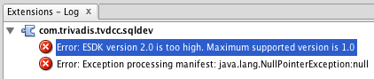

# Frequently Asked Questions

## I cannot install any extension on macOS

Maybe you’ve run into a SQL Developer bug on macOS. See [this blog post](https://www.salvis.com/blog/2015/05/05/cannot-install-extensions-in-sql-developer-4-on-mac-os-x/) for problem details and solution.

## I cannot install any extension on Windows

Have you installed SQL Developer in `C:\Program Files` or `C:\Program Files(x86)`? In this case the files are read-only for a standard Windows user.

To solve the problem start SQL Developer as Administrator or install SQL Developer in an user folder. While the former requires local administrator rights, the latter is always feasible.

## I’ve got errors in the extensions log after installation. What’s wrong?

You are probably using an outdated version of SQL Developer. In this case you see after a restart an error message in the Extensions-Log similar to the following:

SQL Developer 1.x, 2.x and 3.x are based on the Extension Software Development Kit (ESDK) version 1. SQL Developer 4.x requires the use of ESDK version 2. Unfortunately these versions are not compatible. So we decided to support the newest SQL Developer version only.

Please update to SQL Developer 4.x or later since this is a prerequisite for this extension.

## Is unwrapping code processed by the PL/SQL Wrapper of Oracle7, Oracle8, Oracle8i or Oracle9i supported?

No. Beginning with Oracle Database 10g, the algorithm of the PL/SQL Wrapper has changed. PL/SQL Unwrapper currently supports only the latest algorithm used in the PL/SQL Wrapper of Oracle Database 10g, 11g, 12c, 18c and 19c.

## Unwrap does nothing. What’s wrong?

Please check the Logging Page in the Logging window. One of the following error messages is expected:

- Could not unwrap this code. Most probably it was not wrapped with the Oracle 10g, 11g or 12c wrap utility.
- SHA-1 hash values do not match. Expected ‘…’  but got ‘…’. Cannot unwrap code.

If you’ve got the latter message, the wrapped code has most probably been modified.

## What has changed in the latest version?

See the [release information](https://github.com/Trivadis/plsql-unwrapper-sqldev/releases) for each version.

## What are the licensing terms?

The preview/trial version of PL/SQL Cop is licensed under the Creative Commons Attribution-NonCommercial-NoDerivs 3.0 Unported License. You may obtain a copy of the License at https://creativecommons.org/licenses/by-nc-nd/3.0/.

