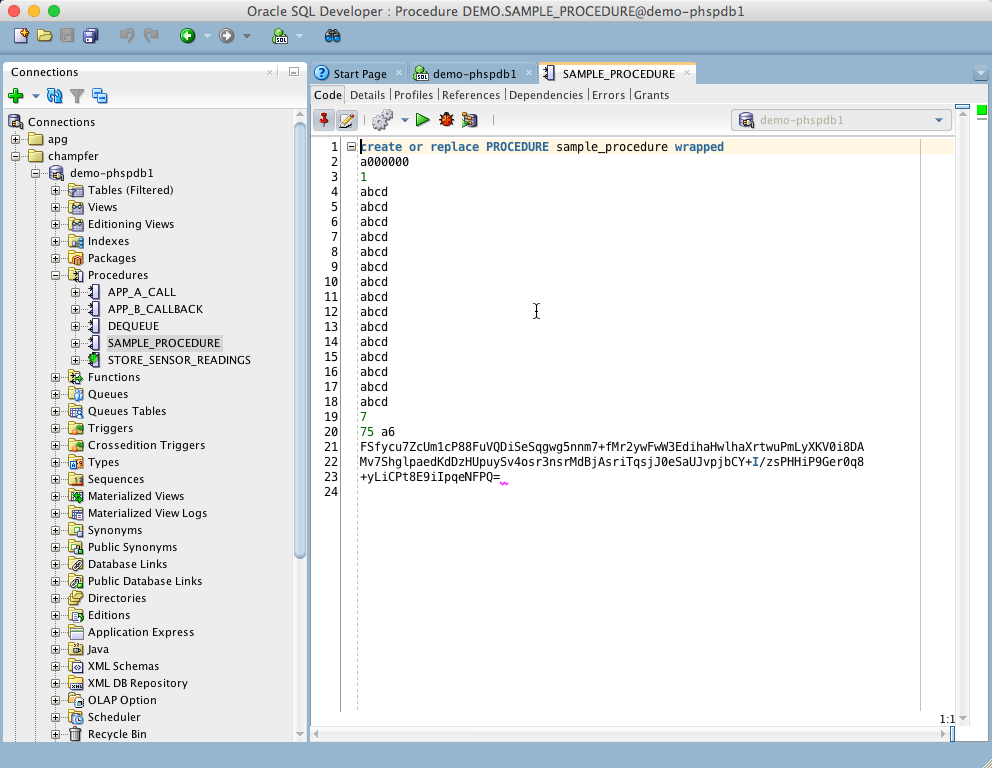
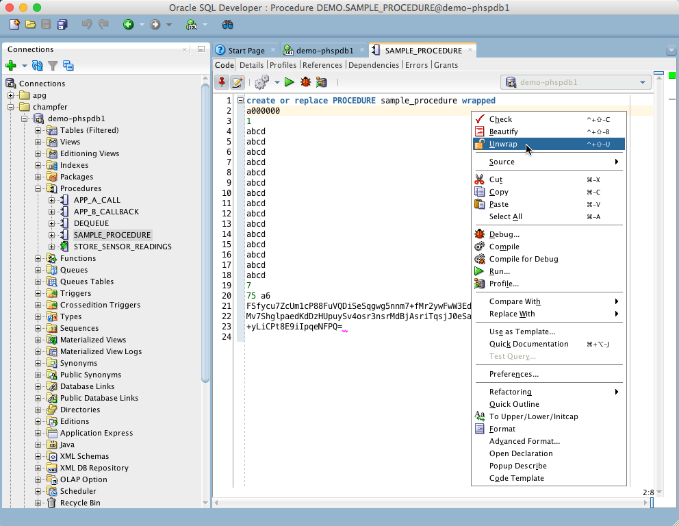
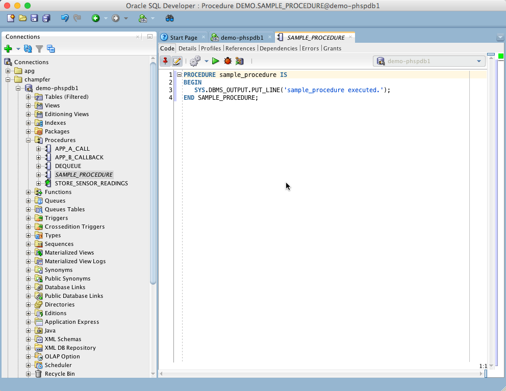
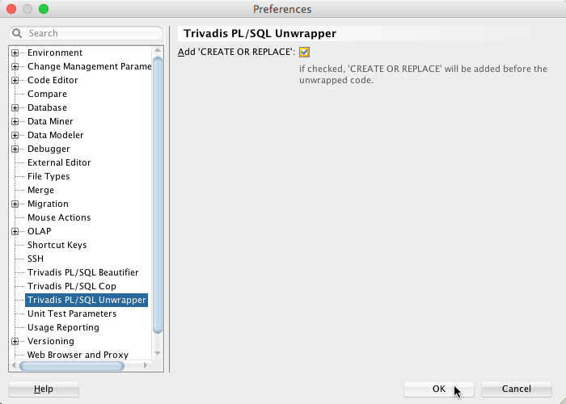
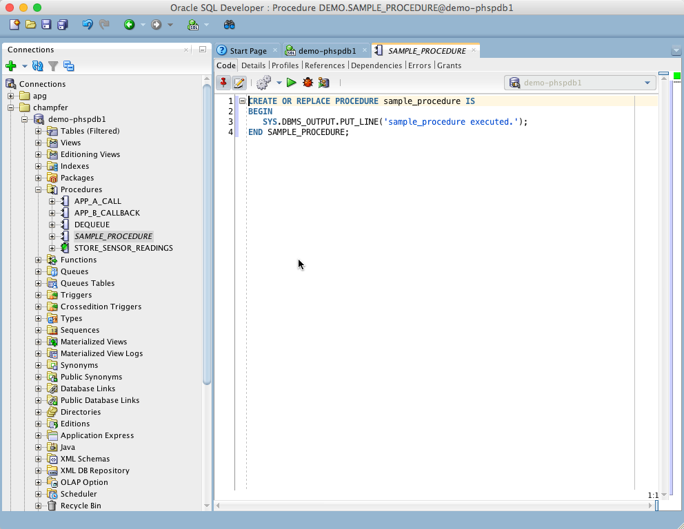
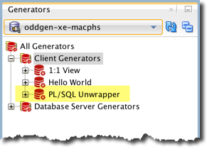
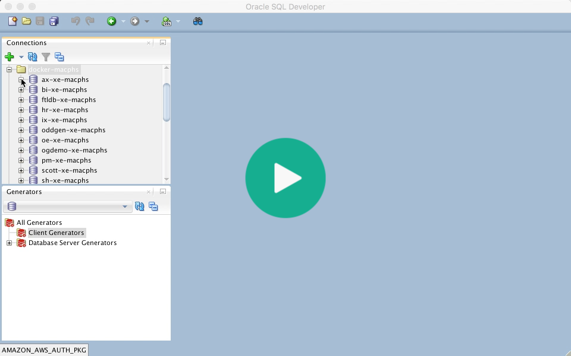
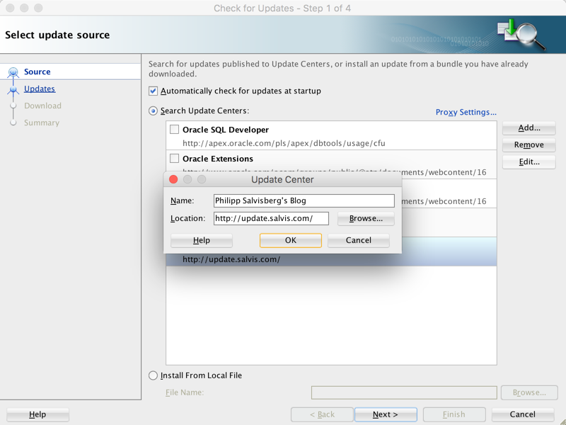

# Discontinuation Notice

@PhilippSalvisberg no longer work for Trivadis - Part of Accenture and no one at Trivadis/Accenture will continue this project. Therefore, this GitHub repository was archived on 30 August 2024.

# PL/SQL Unwrapper for SQL Developer

## Introduction

PL/SQL Unwrapper for SQL Developer is a free extension to unwrap PL/SQL code wrapped with the wrap utility of the Oracle Database Server version 10g, 11g, 12c, 18c or 19c.

## Example

Open a wrapped PL/SQL unit (procedure, function, package specification, package body, type specification or type body) in a SQL Developer editor

Right-click within editor to show the pop-up-menu. Select `Unwrap` or simply press `Ctrl-Shift-U` to unwrap the code.

The editor content is replaced by the unwrapped code.

By default the unwrapped code does not contain a valid DDL statement. In this case the `CREATE` is missing. You may change this behaviour in in the preferences.

Check the `Add ‘CREATE OR REPLACE'` option to get a complete DDL statement.

## Bulk Unwrap

If you install [oddgen for SQL Developer](https://www.oddgen.org/) you will see a `PL/SQL Unwrapper` node in the `Generators` window:

Open the PL/SQL Unwrapper node to show all wrapped objects in the navigator tree. Select one or more objects to unwrap. The following audioless video shows how to unwrap all package bodies in a schema in one go:

## Configure Update Center

Click the `Help` menu and select `Check for Updates…`. Press the `Add` button to register the update center http://update.salvis.com/ . If you have troubles to configure the proxy settings, because your company requires some additional authentication or similar, then I suggest to download PL/SQL Unwrapper for SQL Developer from [here](https://github.com/Trivadis/plsql-unwrapper-sqldev/releases) and use the `Install From Local File` option.

## Releases

You find all releases and release information [here](https://github.com/Trivadis/plsql-unwrapper-sqldev/releases).

## Frequently Asked Questions

see [Frequently Ased Questions](FAQ.md).

## License

PL/SQL Unwrapper is licensed under the Creative Commons Attribution-NonCommercial-NoDerivs 3.0 Unported License. You may obtain a copy of the License at https://creativecommons.org/licenses/by-nc-nd/3.0/.

